# YieldRails Platform Design Document

## Overview

YieldRails is a sophisticated multi-chain payment infrastructure that combines stablecoin stability with automated yield generation. The platform operates across Ethereum, XRPL, Solana, Polygon, Arbitrum, and Base networks, providing users with yield-powered payments while maintaining the stability and speed required for modern financial transactions.

The system architecture follows a modular, microservices approach with strict separation of concerns, enabling independent scaling and maintenance of different components. The platform generates yield through multiple strategies including T-bills via Noble, delta-neutral DeFi strategies via Resolv, and traditional lending protocols like Aave.

## Architecture

### High-Level System Architecture

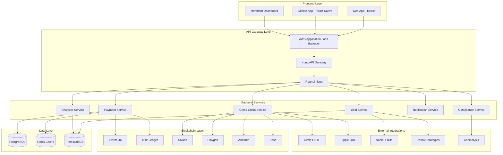

### Smart Contract Architecture

The smart contract layer forms the core of YieldRails' functionality, implementing secure escrow mechanisms with integrated yield generation across multiple blockchain networks.

#### Core Contract Hierarchy

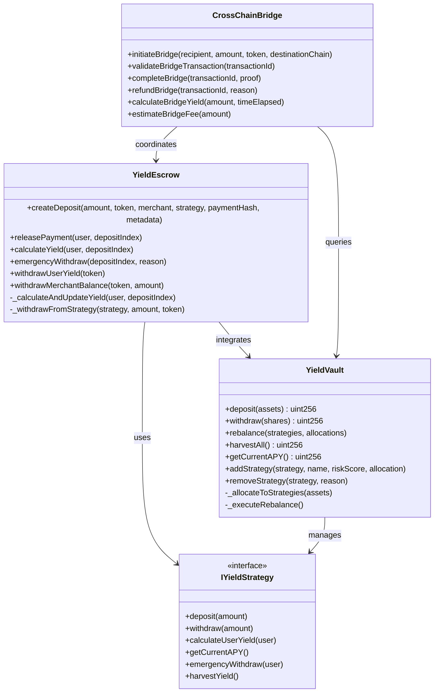

#### YieldEscrow Contract Design

The YieldEscrow contract serves as the primary interface for payment processing, implementing a secure escrow mechanism with automatic yield generation:

**Key Features:**
- Holds user deposits in escrow until merchant releases payment
- Automatically deposits funds into yield strategies
- Distributes yield: 70% to users, 20% to merchants, 10% to protocol
- Implements comprehensive security measures including reentrancy protection
- Supports emergency withdrawal mechanisms
- Enforces daily and per-transaction limits for risk management

**Security Patterns:**
- ReentrancyGuard for all external calls
- AccessControl for role-based permissions
- Pausable for emergency stops
- Input validation and sanitization
- Circuit breaker patterns for risk management

#### YieldVault Contract Design

The YieldVault manages multiple yield strategies and optimizes allocation based on performance and risk metrics:

**Key Features:**
- Multi-strategy yield optimization with automatic rebalancing
- Risk-adjusted allocation algorithms
- Performance tracking and APY calculation
- Emergency withdrawal capabilities
- Fee collection and distribution

**Optimization Algorithms:**
- Weighted allocation based on APY and risk scores
- Automatic rebalancing with cooldown periods
- Performance-based strategy selection
- Risk limit enforcement

### Backend Services Architecture

The backend services layer implements a microservices architecture with clear separation of concerns and independent scalability.

#### Service Communication Pattern

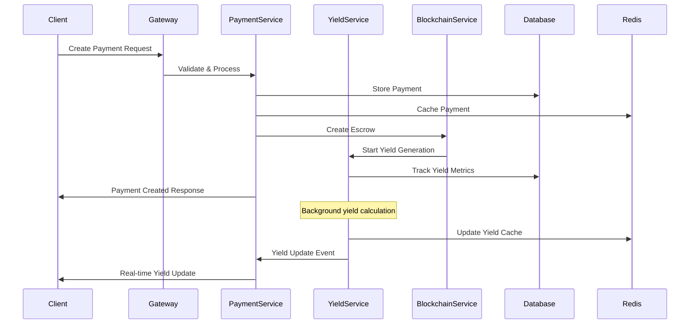

#### PaymentService Design

The PaymentService handles the complete payment lifecycle from creation to completion:

**Core Responsibilities:**
- Payment creation and validation
- Merchant management and verification
- Payment status tracking and updates
- Integration with blockchain services
- Real-time payment monitoring

**Key Methods:**
```typescript
interface PaymentService {
    createPayment(request: CreatePaymentRequest, userId: string): Promise<Payment>
    getPayment(paymentId: string): Promise<Payment | null>
    updatePaymentStatus(paymentId: string, status: PaymentStatus): Promise<Payment>
    confirmPayment(paymentId: string, transactionHash: string): Promise<Payment>
    releasePayment(paymentId: string): Promise<Payment>
    getMerchantPayments(merchantId: string, limit: number, offset: number): Promise<PaymentHistory>
}
```

#### YieldService Design

The YieldService manages yield calculation, optimization, and strategy performance:

**Core Responsibilities:**
- Real-time yield calculation
- Strategy performance monitoring
- Yield optimization algorithms
- APY tracking and reporting
- Risk assessment and management

**Optimization Features:**
- Multi-strategy allocation optimization
- Performance-based rebalancing
- Risk-adjusted returns calculation
- Automated yield harvesting

### Database Design

The database architecture uses PostgreSQL for transactional data with Redis for caching and TimescaleDB for time-series analytics.

#### Core Data Models

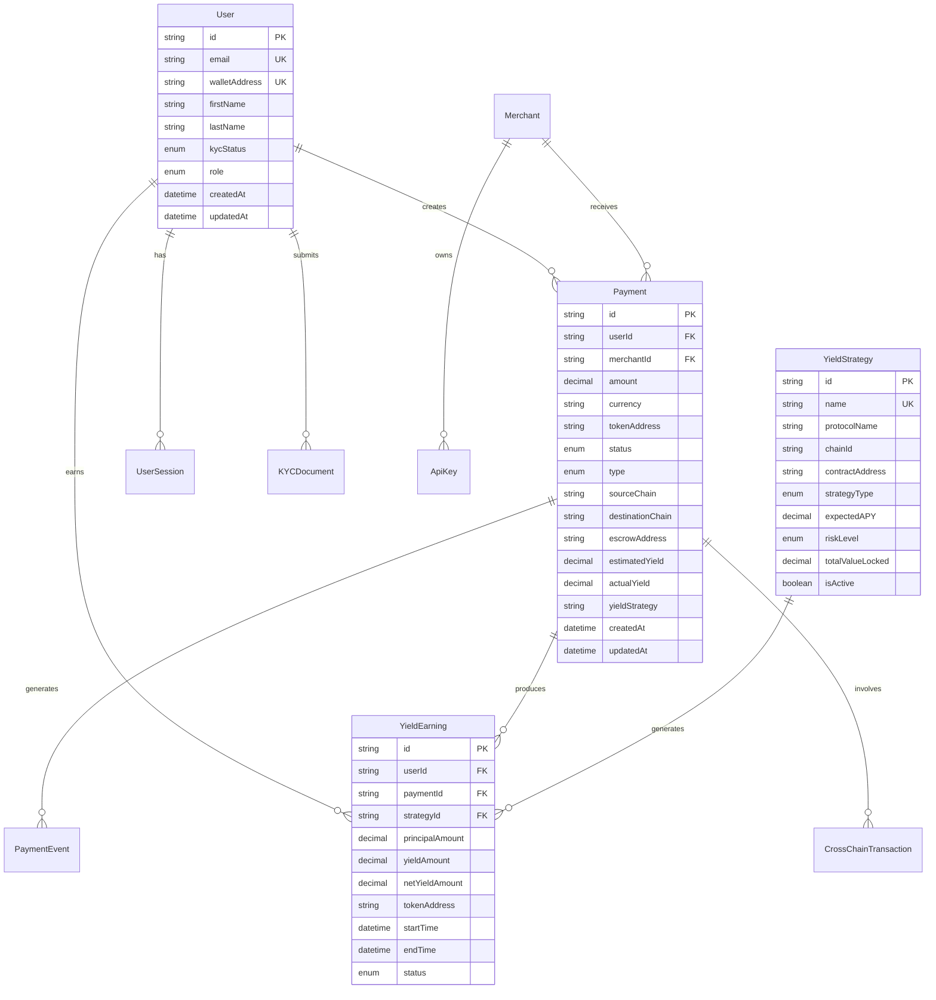

#### Performance Optimization

**Indexing Strategy:**
- Primary keys on all tables
- Composite indexes on frequently queried columns
- Partial indexes for filtered queries
- GIN indexes for JSON columns

**Caching Strategy:**
- Redis for session management and API responses
- Multi-level caching with TTL-based expiration
- Cache invalidation on data updates
- Read-through and write-behind patterns

**Query Optimization:**
- Connection pooling with pgbouncer
- Read replicas for analytics queries
- Query plan optimization
- Prepared statements for frequent queries

## Components and Interfaces

### Frontend Components

The frontend architecture uses React for web applications and React Native for mobile, with shared component libraries and state management.

#### Component Hierarchy

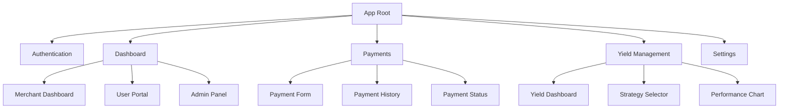

#### State Management

```typescript
interface RootState {
    auth: AuthState
    payments: PaymentsState
    yield: YieldState
    merchants: MerchantsState
    blockchain: BlockchainState
    ui: UIState
}

interface PaymentsState {
    payments: Payment[]
    activePayment: Payment | null
    loading: boolean
    error: string | null
    filters: PaymentFilters
    pagination: PaginationState
}

interface YieldState {
    strategies: YieldStrategy[]
    earnings: YieldEarning[]
    performance: PerformanceMetrics
    allocations: AllocationData
    loading: boolean
}
```

### API Interface Design

The API follows RESTful principles with comprehensive error handling and validation.

#### Payment API Endpoints

```typescript
// Payment Management
POST   /api/payments              // Create new payment
GET    /api/payments/:id          // Get payment details
PUT    /api/payments/:id/status   // Update payment status
GET    /api/payments              // List payments with filters
POST   /api/payments/:id/release  // Release payment to merchant

// Yield Management
GET    /api/yield/strategies      // List available strategies
GET    /api/yield/earnings        // Get user yield earnings
POST   /api/yield/optimize        // Optimize yield allocation
GET    /api/yield/performance     // Get performance metrics

// Cross-Chain Operations
POST   /api/crosschain/bridge     // Initiate cross-chain transfer
GET    /api/crosschain/:id        // Get bridge transaction status
POST   /api/crosschain/:id/complete // Complete bridge transaction

// Compliance
POST   /api/compliance/kyc        // Submit KYC documents
GET    /api/compliance/status     // Get compliance status
POST   /api/compliance/verify     // Verify transaction compliance
```

#### WebSocket Interface

```typescript
interface WebSocketEvents {
    // Payment events
    'payment:created': PaymentCreatedEvent
    'payment:confirmed': PaymentConfirmedEvent
    'payment:released': PaymentReleasedEvent
    'payment:failed': PaymentFailedEvent
    
    // Yield events
    'yield:earned': YieldEarnedEvent
    'yield:optimized': YieldOptimizedEvent
    'yield:strategy_updated': StrategyUpdatedEvent
    
    // Cross-chain events
    'bridge:initiated': BridgeInitiatedEvent
    'bridge:completed': BridgeCompletedEvent
    'bridge:failed': BridgeFailedEvent
}
```

## Data Models

### Payment Data Model

The payment data model captures the complete lifecycle of a payment transaction with yield generation:

```typescript
interface Payment {
    id: string
    userId: string
    merchantId: string
    amount: Decimal
    currency: string
    tokenAddress: string
    tokenSymbol: string
    status: PaymentStatus
    type: PaymentType
    
    // Network information
    sourceChain: string
    destinationChain: string
    sourceTransactionHash?: string
    destTransactionHash?: string
    
    // Addresses
    senderAddress: string
    recipientAddress: string
    escrowAddress?: string
    
    // Yield information
    estimatedYield?: Decimal
    actualYield?: Decimal
    yieldDuration?: number
    yieldStrategy?: string
    
    // Fees
    platformFee?: Decimal
    networkFee?: Decimal
    totalFees?: Decimal
    
    // Metadata
    description?: string
    metadata?: Record<string, any>
    externalReference?: string
    
    // Timestamps
    createdAt: Date
    updatedAt: Date
    confirmedAt?: Date
    releasedAt?: Date
    expiresAt?: Date
}
```

### Yield Strategy Data Model

The yield strategy model defines the configuration and performance metrics for each yield generation strategy:

```typescript
interface YieldStrategy {
    id: string
    name: string
    description?: string
    protocolName: string
    chainId: string
    contractAddress: string
    strategyType: YieldStrategyType
    expectedAPY: Decimal
    riskLevel: RiskLevel
    minAmount: Decimal
    maxAmount?: Decimal
    isActive: boolean
    
    // Configuration
    strategyConfig: Record<string, any>
    
    // Performance metrics
    totalValueLocked: Decimal
    actualAPY?: Decimal
    
    // Timestamps
    createdAt: Date
    updatedAt: Date
}

enum YieldStrategyType {
    LENDING = 'LENDING',
    STAKING = 'STAKING',
    LIQUIDITY_PROVIDING = 'LIQUIDITY_PROVIDING',
    TREASURY_BILLS = 'TREASURY_BILLS',
    YIELD_FARMING = 'YIELD_FARMING'
}

enum RiskLevel {
    LOW = 'LOW',
    MEDIUM = 'MEDIUM',
    HIGH = 'HIGH',
    VERY_HIGH = 'VERY_HIGH'
}
```

## Error Handling

### Smart Contract Error Handling

The smart contracts implement comprehensive error handling with custom errors for gas optimization:

```solidity
// Custom errors for gas optimization
error InvalidAmount();
error InvalidAddress();
error InvalidStrategy();
error InvalidToken();
error InsufficientBalance();
error PaymentAlreadyProcessed();
error OnlyMerchantCanRelease();
error DepositAlreadyReleased();
error DailyLimitExceeded();
error UserLimitExceeded();
error StrategyNotActive();
error TokenNotSupported();
error DepositNotFound();
error YieldCalculationFailed();
error TransferFailed();

// Error handling patterns
modifier validDeposit(uint256 amount, address merchant) {
    require(amount > 0 && amount <= MAX_DEPOSIT_PER_TX, "Invalid amount");
    require(merchant != address(0), "Invalid merchant");
    require(merchant != msg.sender, "Self-payment not allowed");
    
    uint256 today = block.timestamp / 1 days;
    require(dailyVolume[today] + amount <= MAX_DAILY_VOLUME, "Daily limit exceeded");
    _;
}
```

### Backend Error Handling

The backend services implement structured error handling with proper HTTP status codes and error messages:

```typescript
class YieldRailsError extends Error {
    constructor(
        public code: string,
        public message: string,
        public statusCode: number = 500,
        public details?: any
    ) {
        super(message)
        this.name = 'YieldRailsError'
    }
}

// Error types
export const ErrorCodes = {
    INVALID_PAYMENT_AMOUNT: 'INVALID_PAYMENT_AMOUNT',
    UNSUPPORTED_TOKEN: 'UNSUPPORTED_TOKEN',
    INSUFFICIENT_BALANCE: 'INSUFFICIENT_BALANCE',
    PAYMENT_NOT_FOUND: 'PAYMENT_NOT_FOUND',
    YIELD_CALCULATION_FAILED: 'YIELD_CALCULATION_FAILED',
    BRIDGE_TRANSACTION_FAILED: 'BRIDGE_TRANSACTION_FAILED',
    COMPLIANCE_CHECK_FAILED: 'COMPLIANCE_CHECK_FAILED'
} as const

// Error handling middleware
export const errorHandler = (
    error: Error,
    req: Request,
    res: Response,
    next: NextFunction
) => {
    if (error instanceof YieldRailsError) {
        return res.status(error.statusCode).json({
            error: error.code,
            message: error.message,
            details: error.details,
            timestamp: new Date().toISOString()
        })
    }
    
    // Handle unexpected errors
    logger.error('Unexpected error:', error)
    return res.status(500).json({
        error: 'INTERNAL_SERVER_ERROR',
        message: 'An unexpected error occurred',
        timestamp: new Date().toISOString()
    })
}
```

## Testing Strategy

### Smart Contract Testing

The smart contracts achieve 100% test coverage with comprehensive unit and integration tests:

**Testing Framework:**
- Hardhat for Ethereum contracts
- Chai for assertions
- Ethers.js for blockchain interactions
- Coverage reporting with solidity-coverage

**Test Categories:**
- Unit tests for individual functions
- Integration tests for contract interactions
- Gas optimization tests
- Security vulnerability tests
- Edge case and error condition tests

**Example Test Structure:**
```javascript
describe("YieldEscrow", function () {
    describe("Deposit Creation", function () {
        it("Should create deposit successfully", async function () {
            // Test implementation
        })
        
        it("Should revert with invalid amount", async function () {
            // Test implementation
        })
        
        it("Should enforce daily limits", async function () {
            // Test implementation
        })
    })
    
    describe("Payment Release", function () {
        it("Should release payment with yield distribution", async function () {
            // Test implementation
        })
        
        it("Should only allow merchant to release", async function () {
            // Test implementation
        })
    })
})
```

### Backend Testing

The backend services implement comprehensive testing with high coverage requirements:

**Testing Stack:**
- Jest for unit and integration testing
- Supertest for API endpoint testing
- Test databases for isolation
- Mock services for external dependencies

**Coverage Requirements:**
- 95% line coverage
- 95% function coverage
- 95% branch coverage
- 95% statement coverage

**Test Categories:**
- Unit tests for service methods
- Integration tests for API endpoints
- Database integration tests
- WebSocket connection tests
- Error handling tests

### End-to-End Testing

The platform includes comprehensive E2E testing covering complete user workflows:

**E2E Test Scenarios:**
- Complete payment flow from creation to release
- Cross-chain bridge operations
- Yield generation and withdrawal
- Merchant dashboard operations
- Compliance and KYC workflows

## Business Strategy and Market Positioning

### Strategic Positioning

YieldRails positions itself as **"Stripe for Stablecoins + Built-in Yields"**, targeting the $120B+ annual yield opportunity in the stablecoin ecosystem. The platform addresses the fundamental gap where traditional payment systems offer 0% yields while crypto volatility makes payments impractical.

#### Competitive Advantages

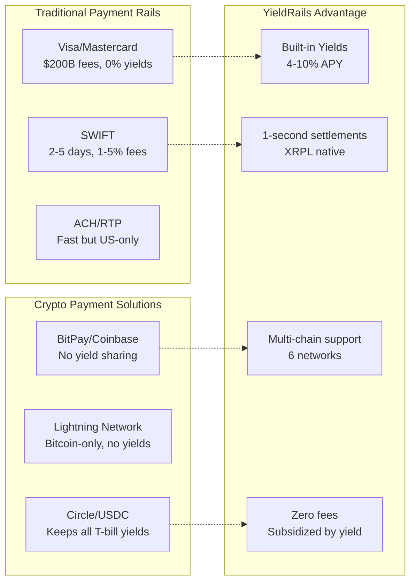

### Go-to-Market Strategy

#### Phase 1: Crypto-Native Merchants (Months 1-3)
- Target 50 pilot merchants with high-volume, low-margin businesses
- Offer "0% fees + 2% yield" for first 6 months
- Focus on Shopify/WooCommerce plugin integrations

#### Phase 2: Traditional E-commerce Expansion (Months 4-6)
- Partner with payment processors and e-commerce platforms
- Implement viral referral programs ($200 + yield boost per merchant)
- Launch airdrop campaigns targeting stablecoin communities

#### Phase 3: Geographic Expansion (Months 7-12)
- LatAm remittances (Mexico, Brazil) - $72B market
- SEA corridors (Philippines, Vietnam)
- European EURC adoption

### Partnership Strategy

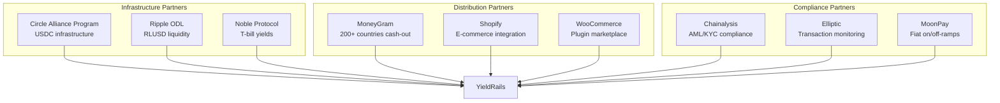

## Testing Strategy and Quality Assurance

### Comprehensive Testing Framework

The YieldRails platform implements a rigorous testing strategy with 100% smart contract coverage and 95%+ overall system coverage.

#### Testing Pyramid

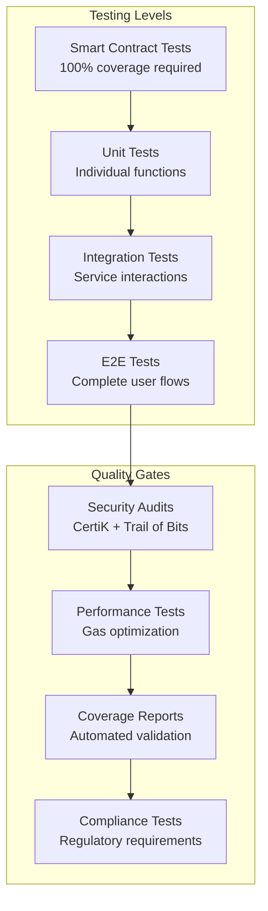

#### Smart Contract Testing Standards

```solidity
// Example comprehensive test structure
describe("YieldEscrow", function () {
    describe("Deployment", function () {
        it("Should deploy with correct parameters")
        it("Should revert with invalid addresses")
        it("Should set correct constants")
    })
    
    describe("Deposit Creation", function () {
        it("Should create deposit successfully")
        it("Should revert with invalid amounts")
        it("Should enforce daily limits")
        it("Should handle edge cases")
    })
    
    describe("Yield Calculation", function () {
        it("Should calculate yield accurately")
        it("Should handle time edge cases")
        it("Should prevent precision errors")
    })
    
    describe("Security Tests", function () {
        it("Should prevent reentrancy attacks")
        it("Should enforce access controls")
        it("Should handle emergency scenarios")
    })
    
    describe("Gas Optimization", function () {
        it("Should use <100k gas per transaction")
        it("Should optimize storage operations")
    })
})
```

#### Backend Testing Architecture

```typescript
// Comprehensive API testing structure
describe('Payment Service', () => {
    describe('Unit Tests', () => {
        it('should validate payment creation')
        it('should handle error conditions')
        it('should calculate yields correctly')
    })
    
    describe('Integration Tests', () => {
        it('should interact with blockchain services')
        it('should update database correctly')
        it('should send notifications')
    })
    
    describe('Performance Tests', () => {
        it('should handle 1000+ TPS')
        it('should maintain <200ms response time')
        it('should scale horizontally')
    })
})
```

### Quality Gates and CI/CD

#### Automated Quality Validation

```yaml
# Comprehensive CI/CD pipeline
name: YieldRails Quality Gates
on: [push, pull_request]

jobs:
  smart-contract-tests:
    steps:
      - name: Run comprehensive tests
        run: npx hardhat test --coverage
      - name: Validate 100% coverage
        run: |
          COVERAGE=$(cat coverage/lcov.info | grep -o 'SF:' | wc -l)
          if [ "$COVERAGE" -lt "100" ]; then exit 1; fi
      - name: Gas optimization check
        run: npx hardhat test --gas-reporter
      - name: Security audit
        run: npx slither contracts/src/

  backend-quality-gates:
    steps:
      - name: Unit tests with coverage
        run: npm run test:coverage
      - name: Integration tests
        run: npm run test:integration
      - name: Performance tests
        run: npm run test:performance
      - name: Security scan
        run: npm audit --audit-level=moderate

  deployment-validation:
    steps:
      - name: Testnet deployment
        run: npx hardhat deploy --network sepolia
      - name: Contract verification
        run: npx hardhat verify --network sepolia
      - name: E2E validation
        run: npm run test:e2e:testnet
```

## Regulatory Compliance and Legal Framework

### Multi-Jurisdiction Legal Structure

#### Primary Jurisdiction: UAE DMCC Free Zone
- **0% tax on yields** - Optimal for yield distribution model
- **Crypto-friendly regulations** - Clear framework for stablecoin operations
- **International banking access** - DBS Bank, JPMorgan partnerships
- **Strategic location** - Bridge between East and West markets

#### Secondary Jurisdiction: US Compliance
- **GENIUS Act alignment** - Compliant framework for stablecoins
- **SEC guidance compliance** - USDC as "Covered Stablecoin"
- **FinCEN registration** - Money services business compliance
- **State-by-state licensing** - As required for operations

### Compliance Architecture

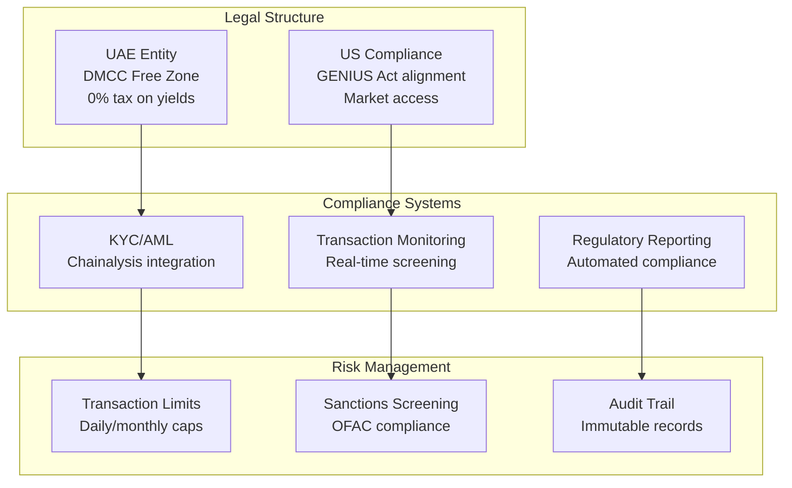

### Yield Classification Strategy

To avoid securities regulation, yields are classified as "utility rewards":
- **Utility-based rewards** for using the payment infrastructure
- **Not investment contracts** under Howey Test analysis
- **Operational rewards** similar to credit card cashback
- **No expectation of profit** from others' efforts

## Risk Management and Security

### Multi-Layer Security Architecture

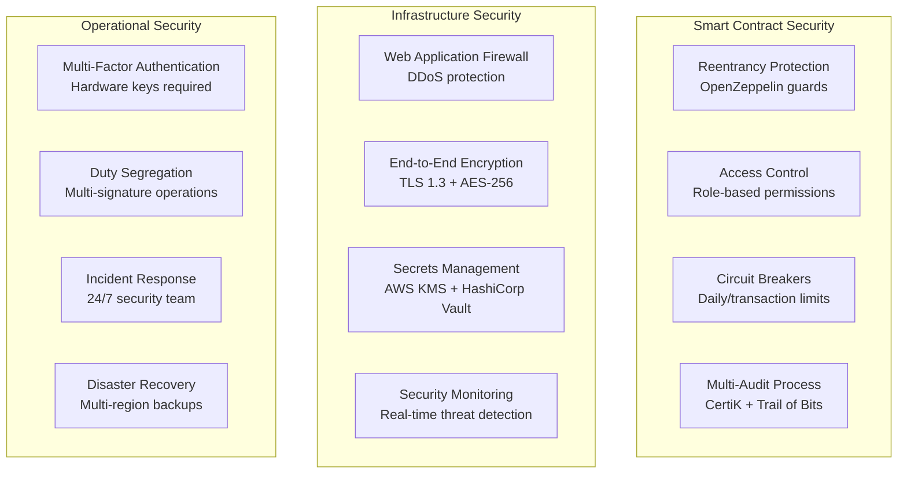

### Risk Mitigation Strategies

#### Smart Contract Risks
- **Formal verification** of critical functions
- **Multi-audit approach** with top-tier firms
- **Bug bounty program** with $100K+ rewards
- **Gradual rollout** with TVL caps

#### Yield Strategy Risks
- **Diversified allocation** across multiple protocols
- **Risk scoring system** (1-10 scale)
- **Maximum allocation limits** (50% per strategy)
- **Emergency exit mechanisms** for all strategies

#### Regulatory Risks
- **Multi-jurisdiction structure** for flexibility
- **Proactive compliance** with emerging regulations
- **Legal opinion letters** for yield classification
- **Regulatory monitoring** and adaptation procedures

## Success Metrics and KPIs

### Growth Metrics

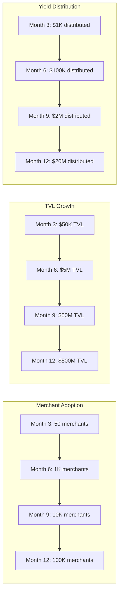

### Technical Performance KPIs

| Metric | Target | Measurement |
|--------|--------|-------------|
| Smart Contract Gas Usage | <100k gas/tx | Automated testing |
| API Response Time | <200ms (95th percentile) | Real-time monitoring |
| System Uptime | 99.9% availability | 24/7 monitoring |
| Test Coverage | 100% contracts, 95% overall | CI/CD validation |
| Payment Success Rate | >99.5% | Transaction monitoring |
| Yield APY Range | 4-10% consistently | Strategy performance |

### Business KPIs

| Metric | Month 3 | Month 6 | Month 9 | Month 12 |
|--------|---------|---------|---------|----------|
| Monthly Revenue | $0 | $50K | $500K | $5M |
| Active Merchants | 50 | 1K | 10K | 100K |
| Monthly Volume | $100K | $5M | $50M | $500M |
| User Retention | >70% | >75% | >80% | >85% |
| NPS Score | >60 | >65 | >70 | >75 |

This comprehensive design document provides the foundation for implementing the YieldRails platform with proper architecture, security, scalability, business strategy, and quality assurance considerations.